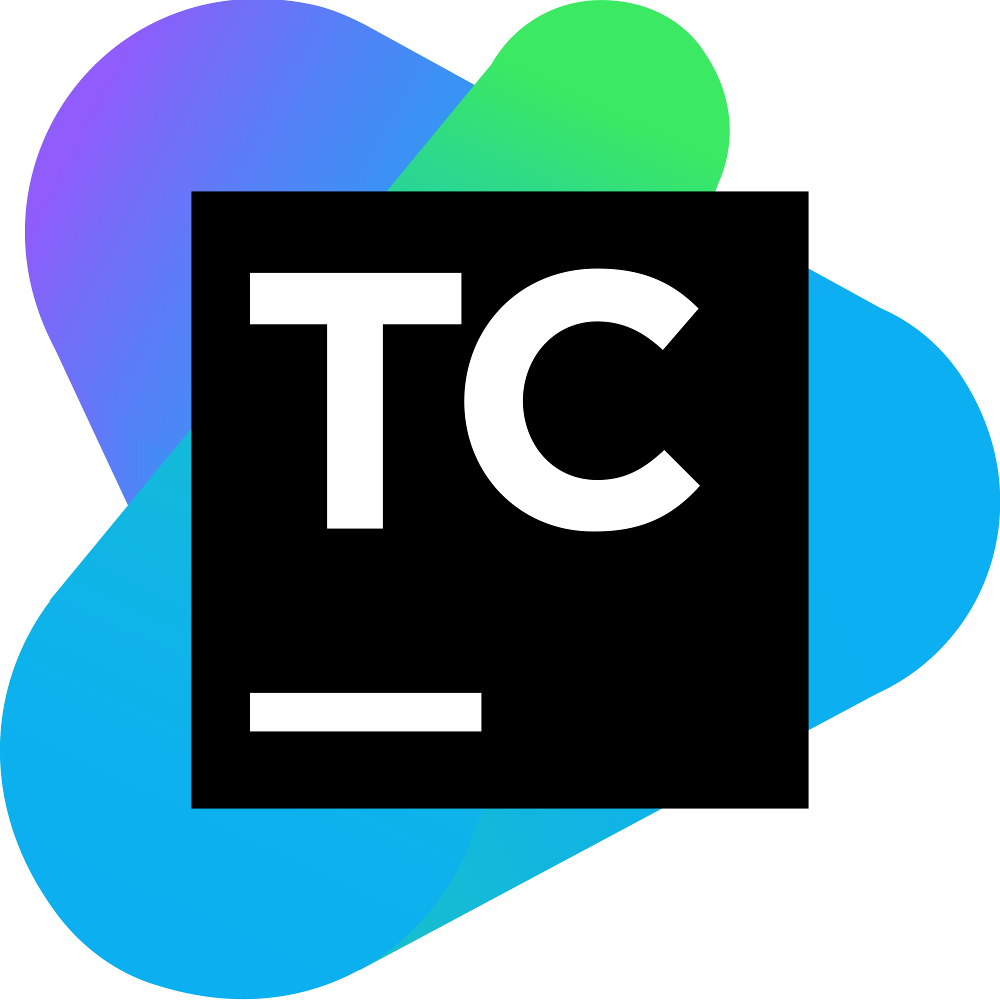

 

[![Contributors][contributors-shield]][contributors-url]
[![Forks][forks-shield]][forks-url]
[![Stargazers][stars-shield]][stars-url]
[![Issues][issues-shield]][issues-url]
[![MIT License][license-shield]][license-url]

 

  

  <h3  align="center" >Checkmarx CI/CD Integrations</h3>

  

     
    <a href="https://checkmarx.com/resource/documents/en/34965-68684-checkmarx-one-ci-cd-integrations.html" target="_blank"><strong>AST CLI Integrations the docs »</strong></a>
     
     
  

<!-- TABLE OF CONTENTS -->

  
Table of Contents

  <ol>
    <li>
      <a href="#about-the-project">About The Project</a>
    </li>
    <li><a href="#contributing">Contributing</a></li>
    <li><a href="#license">License</a></li>
    <li><a href="#contact">Contact</a></li>
  </ol>

<!-- ABOUT THE PROJECT -->
## About The Project

The purpose of this repository is to share examples of CI/CD integrations with Checkmarx products.

We are continuously trying to update this repo with useful templates
If you have suggestions for improvement feel free to share them with us!

<!-- CONTRIBUTING -->
## Contributing

Contributions are what make the open source community such an amazing place to learn, inspire, and create. Any contributions you make are **greatly appreciated**.

1. Fork the Project
2. Create your Feature Branch (`git checkout -b feature/AmazingFeature`)
3. Commit your Changes (`git commit -m 'Add some AmazingFeature'`)
4. Push to the Branch (`git push origin feature/AmazingFeature`)
5. Open a Pull Request

## Checkmarx AST Integrations

<table>
    <tr align="center">
        <td width="25%">
            
        </td>
        <td width="25%">
            
        </td>
        <td width="25%">
            
        </td>
    </tr>
    <tr align="center">
        <td>
            

                <strong>CLI</strong>
                 
                <a href="https://github.com/Checkmarx/homebrew-ast-cli" target="_blank"><strong>Homebrew »</strong></a>
                 
                <a href="https://checkmarx.com/resource/documents/en/34965-68620-checkmarx-one-cli-tool.html" target="_blank"><strong>Documentation »</strong></a>
                 
                <a href="https://github.com/Checkmarx/ast-cli" target="_blank"><strong>Source code »</strong></a>
                 
            

        </td>
        <td>
            

                <strong>Azure Devops</strong>
                 
                <a href="https://marketplace.visualstudio.com/items?itemName=checkmarx.checkmarx-ast-azure-plugin" target="_blank"><strong>Marketplace  »</strong></a>
                 
                <a href="https://checkmarx.com/resource/documents/en/34965-68709-checkmarx-one-azure-devops-plugin.html" target="_blank"><strong>Documentation »</strong></a>
                 
                <a href="https://github.com/Checkmarx/ast-azure-plugin" target="_blank"><strong>Source code »</strong></a>
                 
            

        </td>
        <td>
            

                <strong>Github Action</strong>
                 
                <a href="https://github.com/marketplace/actions/checkmarx-ast-github-action" target="_blank"><strong>Marketplace »</strong></a>
                 
                <a href="https://checkmarx.com/resource/documents/en/34965-68702-checkmarx-one-github-actions.html" target="_blank" ><strong>Documentation »</strong></a>
                 
                <a href="https://github.com/Checkmarx/ast-github-action" target="_blank"><strong>Source code »</strong></a>
                 
            

        </td>
    </tr>
    <tr align="center" >
        <td>
            
        </td>
        <td >
            
        </td>
        <td>
            
        </td>
    </tr>
    <tr align="center">
        <td>
            

                <strong>Jenkins</strong>
                 
                <a href="https://plugins.jenkins.io/checkmarx-ast-scanner/" target="_blank"><strong>Marketplace »</strong></a>
                 
                <a href="https://checkmarx.com/resource/documents/en/34965-68685-checkmarx-one-jenkins-plugin.html" target="_blank"><strong>Documentation »</strong></a>
                 
                <a href="https://github.com/jenkinsci/checkmarx-ast-scanner-plugin" target="_blank"><strong>Source code »</strong></a>
                 
            

        </td>
        <td>
            

                <strong>Maven</strong>
                 
                <a href="https://mvnrepository.com/artifact/com.checkmarx/ast-cli-maven-plugin" target="_blank"><strong>Marketplace
                        »</strong></a>
                 
                <a href="https://checkmarx.com/resource/documents/en/34965-68718-checkmarx-one-maven-plugin.html" target="_blank"><strong>Documentation »</strong></a>
                 
                <a href="https://github.com/CheckmarxDev/ast-cli-maven-plugin" target="_blank"><strong>Source code »</strong></a>
                 
            

        </td>
        <td>
            

                <strong>TeamCity</strong>
                 
                <a href="https://plugins.jetbrains.com/plugin/17610-checkmarx-ast" target="_blank"><strong>Marketplace »</strong></a>
                 
                <a href="https://checkmarx.com/resource/documents/en/34965-68696-checkmarx-one-teamcity-plugin.html" target="_blank"><strong>Documentation »</strong></a>
                 
                <a href="https://github.com/Checkmarx/ast-teamcity-plugin" target="_blank"><strong>Source code »</strong></a>
                 
            

        </td>
    </tr>
    <tr align="center">
        <td>
            
        </td>
        <td>
            
        </td>
        <td>
            
        </td>
    </tr>
    <tr align="center">
        <td>
            

                <strong>Eclipse</strong>
                 
                <a href="https://marketplace.eclipse.org/content/checkmarx-ast-plugin" target="_blank"><strong>Marketplace »</strong></a>
                 
                <a href="https://checkmarx.com/resource/documents/en/34965-68728-checkmarx-one-eclipse-plugin.html" target="_blank"><strong>Documentation »</strong></a>
                 
                <a href="https://github.com/Checkmarx/ast-eclipse-plugin" target="_blank"><strong>Source code »</strong></a>
                 
            

        </td>
        <td>
            

                <strong>Jetbrains IDEs</strong>
                 
                <a href="https://plugins.jetbrains.com/plugin/17672-checkmarx-ast" target="_blank"><strong>Marketplace »</strong></a>
                 
                <a href="https://checkmarx.com/resource/documents/en/34965-68733-checkmarx-one-jetbrains-plugin.html" target="_blank"><strong>Documentation »</strong></a>
                 
                <a href="https://github.com/Checkmarx/ast-jetbrains-plugin" target="_blank"><strong>Source code »</strong></a>
                 
            

        </td>
        <td>
            

                <strong>Visual Studio Code</strong>
                 
                <a href="https://marketplace.visualstudio.com/items?itemName=checkmarx.ast-results" target="_blank"><strong>Marketplace »</strong></a>
                 
                <a href="https://checkmarx.com/resource/documents/en/34965-68742-checkmarx-one-visual-studio-code-extension--plugin-.html" target="_blank"><strong>Documentation »</strong></a>
                 
                <a href="https://github.com/Checkmarx/ast-vscode-extension" target="_blank"><strong>Source code »</strong></a>
                 
            

        </td>
    </tr>
    <tr align="center">
        <td>
            
        </td>
        <td>
            
        </td>
        <td>
            
        </td>
    </tr>
    <tr align="center">
        <td>
            

                <strong>Bamboo</strong>
                 
                <a href="https://checkmarx.com/resource/documents/en/34965-68723-checkmarx-one-bamboo-integration.html" target="_blank"><strong>Documentation »</strong></a>
                 
                <a href="https://github.com/Checkmarx/ci-cd-integrations/tree/main/Bamboo/bamboo-specs" target="_blank"><strong>Example »</strong></a>
                 
            

        </td>
        <td>
            

                <strong>Bitbucket</strong>
                 
                <a href="https://checkmarx.com/resource/documents/en/34965-68720-checkmarx-one-bitbucket-pipelines-integration.html" target="_blank"><strong>Documentation »</strong></a>
                 
                <a href="https://github.com/Checkmarx/ci-cd-integrations/tree/main/Bitbucket" target="_blank"><strong>Example »</strong></a>
                 
            

        </td>
        <td>
            

                <strong>Sonar</strong>
                 
                <a href="https://checkmarx.com/resource/documents/en/34965-68726-sonar-results-for-checkmarx-one--example-for-github-action-.html" target="_blank"><strong>Documentation »</strong></a>
                 
                <a href="https://github.com/Checkmarx/ci-cd-integrations/tree/main/Sonar" target="_blank"><strong>Example »</strong></a>
                 
            

        </td>
    </tr>
    <tr align="center">
        <td>
            
        </td>
        <td>
            
        </td>
        <td>
            
        </td>
    </tr>
    <tr align="center">
        <td>
            

                <strong>SCA Resolver</strong>
                 
                <a href="https://sca-downloads.s3.amazonaws.com/cli/latest/ScaResolver-linux64.tar.gz" target="_blank"><strong>Download »</strong></a>
                 
                <a href="https://checkmarx.com/resource/documents/en/34965-68725-using-sca-resolver-in-checkmarx-one-ci-cd-integrations.html" target="_blank"><strong>Documentation »</strong></a>
                 
                <a href="https://github.com/Checkmarx/ci-cd-integrations/tree/main/CxScaResolver" target="_blank"><strong>Example »</strong></a>
                 
            

        </td>
        <td>
            

                <strong>Gitlab</strong>
                 
                <a href="https://checkmarx.com/resource/documents/en/34965-68722-checkmarx-one-gitlab-integration.html" target="_blank"><strong>Documentation »</strong></a>
                 
                <a href="https://github.com/Checkmarx/ci-cd-integrations/tree/main/GitlabCICD/v1" target="_blank"><strong>Example »</strong></a>
                 
            

        </td>
        <td>
            

                <strong>Circle CI</strong>
                 
                <a href="https://checkmarx.com/resource/documents/en/34965-68721-checkmarx-one-circleci-integration.html" target="_blank"><strong>Documentation »</strong></a>
                 
                <a href="https://github.com/Checkmarx/ci-cd-integrations/tree/main/CircleCI" target="_blank"><strong>Example »</strong></a>
                 
            

        </td>
    </tr>
</table>

<!-- LICENSE -->
## License

Distributed under the [Apache 2.0](LICENSE). See `LICENSE` for more information.

<!-- CONTACT -->
## Contact

Checkmarx Team

Project Link: [https://github.com/checkmarx/ci-cd-integrations](https://github.com/checkmarx/ci-cd-integrations)

© 2022 Checkmarx Ltd. All Rights Reserved.

<!-- MARKDOWN LINKS & IMAGES -->
[contributors-shield]: https://img.shields.io/github/contributors/checkmarx/ci-cd-integrations.svg
[contributors-url]:https://github.com/checkmarx/ci-cd-integrations/graphs/contributors
[forks-shield]: https://img.shields.io/github/forks/checkmarx/ci-cd-integrations.svg
[forks-url]: https://github.com/checkmarx/ci-cd-integrations/network/members
[stars-shield]: https://img.shields.io/github/stars/checkmarx/ci-cd-integrations.svg
[stars-url]: https://github.com/checkmarx/ci-cd-integrations/stargazers
[issues-shield]: https://img.shields.io/github/issues/checkmarx/ci-cd-integrations.svg
[issues-url]: https://github.com/checkmarx/ci-cd-integrations/issues
[license-shield]: https://img.shields.io/github/license/checkmarx/ci-cd-integrations.svg
[license-url]: https://github.com/checkmarx/ci-cd-integrations/blob/master/LICENSE